<h1 style="color: #009F55">Bloblow</h1>

<div align="center">
  <p>
    <b>블로블로, 블로그를 불러오다.</b><br/>
    <b>키워드 기반 네이버 블로그 게시물 분석 서비스</b>
  </p>
  <a href="https://github.com/Team-Bloblow/Bloblow-Client" rel="noopener noreferrer" target="_blank">클라이언트 </a> | <a href="https://github.com/Team-Bloblow/Bloblow-Server" rel="noopener noreferrer" target="_blank">서버 </a> | <a href="https://github.com/Team-Bloblow/Bloblow-puppeteer" rel="noopener noreferrer" target="_blank">크롤링 서버 </a>
</div>

<br/>

<div align="center">
  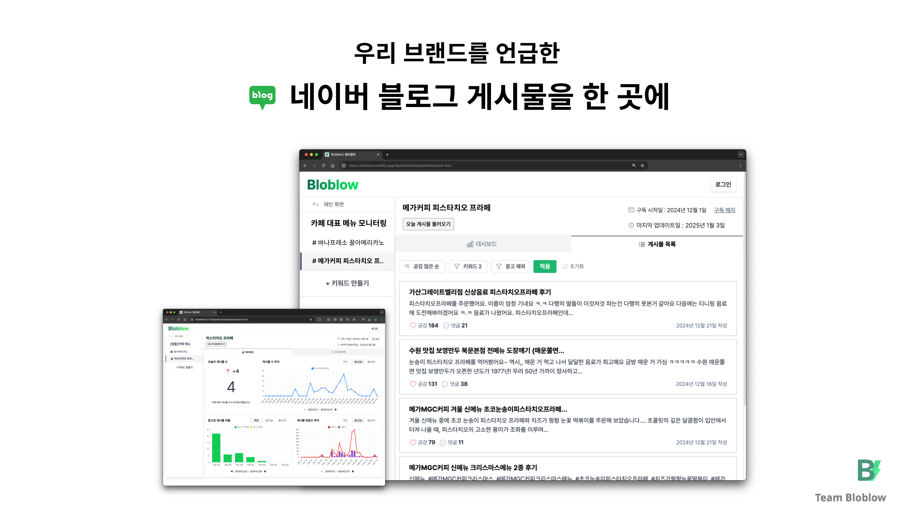
</div>

<br/>

# 목차

<!-- toc -->

- [1. 개발 배경](#1-%EA%B0%9C%EB%B0%9C-%EB%B0%B0%EA%B2%BD)
  - [1-1. 브랜드가 언급된 블로그 게시물을 일일이 찾는 과정이 번거롭지 않을까?](#1-1-%EB%B8%8C%EB%9E%9C%EB%93%9C%EA%B0%80-%EC%96%B8%EA%B8%89%EB%90%9C-%EB%B8%94%EB%A1%9C%EA%B7%B8-%EA%B2%8C%EC%8B%9C%EB%AC%BC%EC%9D%84-%EC%9D%BC%EC%9D%BC%EC%9D%B4-%EC%B0%BE%EB%8A%94-%EA%B3%BC%EC%A0%95%EC%9D%B4-%EB%B2%88%EA%B1%B0%EB%A1%AD%EC%A7%80-%EC%95%8A%EC%9D%84%EA%B9%8C)
  - [1-2. 네이버 블로그 검색과 차별화된 가치를 어떻게 제공할까?](#1-2-%EB%84%A4%EC%9D%B4%EB%B2%84-%EB%B8%94%EB%A1%9C%EA%B7%B8-%EA%B2%80%EC%83%89%EA%B3%BC-%EC%B0%A8%EB%B3%84%ED%99%94%EB%90%9C-%EA%B0%80%EC%B9%98%EB%A5%BC-%EC%96%B4%EB%96%BB%EA%B2%8C-%EC%A0%9C%EA%B3%B5%ED%95%A0%EA%B9%8C)
- [2. 기술 스택](#2-%EA%B8%B0%EC%88%A0-%EC%8A%A4%ED%83%9D)
  - [2-1. 기술 스택](#2-1-%EA%B8%B0%EC%88%A0-%EC%8A%A4%ED%83%9D)
  - [2-2. Zustand 전역 상태 관리](#2-2-zustand-%EC%A0%84%EC%97%AD-%EC%83%81%ED%83%9C-%EA%B4%80%EB%A6%AC)
  - [2-3. React Query 서버 상태 관리](#2-3-react-query-%EC%84%9C%EB%B2%84-%EC%83%81%ED%83%9C-%EA%B4%80%EB%A6%AC)
- [3. 기능](#3-%EA%B8%B0%EB%8A%A5)
- [4. 개발 과정](#4-%EA%B0%9C%EB%B0%9C-%EA%B3%BC%EC%A0%95)
  - [4-1. 크롤링을 사용하여 네이버 블로그 게시물을 가져오는 이유](#4-1-%ED%81%AC%EB%A1%A4%EB%A7%81%EC%9D%84-%EC%82%AC%EC%9A%A9%ED%95%98%EC%97%AC-%EB%84%A4%EC%9D%B4%EB%B2%84-%EB%B8%94%EB%A1%9C%EA%B7%B8-%EA%B2%8C%EC%8B%9C%EB%AC%BC%EC%9D%84-%EA%B0%80%EC%A0%B8%EC%98%A4%EB%8A%94-%EC%9D%B4%EC%9C%A0)
  - [4-2. 네이버 API 응답 내부의 `&amp;` 은 무엇이며 어떻게 필터링할까?](#4-2-%EB%84%A4%EC%9D%B4%EB%B2%84-api-%EC%9D%91%EB%8B%B5-%EB%82%B4%EB%B6%80%EC%9D%98-amp-%EC%9D%80-%EB%AC%B4%EC%97%87%EC%9D%B4%EB%A9%B0-%EC%96%B4%EB%96%BB%EA%B2%8C-%ED%95%84%ED%84%B0%EB%A7%81%ED%95%A0%EA%B9%8C)
  - [4-3. 서버 상태는 어떻게 관리할 수 있을까? 우리는 왜 React Query를 도입했는가?](#4-3-%EC%84%9C%EB%B2%84-%EC%83%81%ED%83%9C%EB%8A%94-%EC%96%B4%EB%96%BB%EA%B2%8C-%EA%B4%80%EB%A6%AC%ED%95%A0-%EC%88%98-%EC%9E%88%EC%9D%84%EA%B9%8C-%EC%9A%B0%EB%A6%AC%EB%8A%94-%EC%99%9C-react-query%EB%A5%BC-%EB%8F%84%EC%9E%85%ED%96%88%EB%8A%94%EA%B0%80)
  - [4-4. 모달을 root DOM node에서 분리하여 렌더링 시킬 수 있는 방법은 없을까?](#4-4-%EB%AA%A8%EB%8B%AC%EC%9D%84-root-dom-node%EC%97%90%EC%84%9C-%EB%B6%84%EB%A6%AC%ED%95%98%EC%97%AC-%EB%A0%8C%EB%8D%94%EB%A7%81-%EC%8B%9C%ED%82%AC-%EC%88%98-%EC%9E%88%EB%8A%94-%EB%B0%A9%EB%B2%95%EC%9D%80-%EC%97%86%EC%9D%84%EA%B9%8C)
  - [4-5. 모달을 전역적으로 어떻게 관리하면 좋을까?](#4-5-%EB%AA%A8%EB%8B%AC%EC%9D%84-%EC%A0%84%EC%97%AD%EC%A0%81%EC%9C%BC%EB%A1%9C-%EC%96%B4%EB%96%BB%EA%B2%8C-%EA%B4%80%EB%A6%AC%ED%95%98%EB%A9%B4-%EC%A2%8B%EC%9D%84%EA%B9%8C)
  - [4-6. 협업을 위한 로직 재사용성과 관심사 분리를 위해 커스텀 훅을 만들어볼까?](#4-6-%ED%98%91%EC%97%85%EC%9D%84-%EC%9C%84%ED%95%9C-%EB%A1%9C%EC%A7%81-%EC%9E%AC%EC%82%AC%EC%9A%A9%EC%84%B1%EA%B3%BC-%EA%B4%80%EC%8B%AC%EC%82%AC-%EB%B6%84%EB%A6%AC%EB%A5%BC-%EC%9C%84%ED%95%B4-%EC%BB%A4%EC%8A%A4%ED%85%80-%ED%9B%85%EC%9D%84-%EB%A7%8C%EB%93%A4%EC%96%B4%EB%B3%BC%EA%B9%8C)
- [5. 사용자 편의성 개선](#5-%EC%82%AC%EC%9A%A9%EC%9E%90-%ED%8E%B8%EC%9D%98%EC%84%B1-%EA%B0%9C%EC%84%A0)
  - [5-1. 블로그 게시물을 크롤링하는 시간 줄이기](#5-1-%EB%B8%94%EB%A1%9C%EA%B7%B8-%EA%B2%8C%EC%8B%9C%EB%AC%BC%EC%9D%84-%ED%81%AC%EB%A1%A4%EB%A7%81%ED%95%98%EB%8A%94-%EC%8B%9C%EA%B0%84-%EC%A4%84%EC%9D%B4%EA%B8%B0)
  - [5-2. 구독을 시작했을 때 언제 등록된 게시물부터 보여주는 것이 좋을까?](#5-2-%EA%B5%AC%EB%8F%85%EC%9D%84-%EC%8B%9C%EC%9E%91%ED%96%88%EC%9D%84-%EB%95%8C-%EC%96%B8%EC%A0%9C-%EB%93%B1%EB%A1%9D%EB%90%9C-%EA%B2%8C%EC%8B%9C%EB%AC%BC%EB%B6%80%ED%84%B0-%EB%B3%B4%EC%97%AC%EC%A3%BC%EB%8A%94-%EA%B2%83%EC%9D%B4-%EC%A2%8B%EC%9D%84%EA%B9%8C)
  - [5-3. 게시물 목록에서 광고성 글을 바로 확인할 수 있도록, 크롤링 직후에 미리 선별해두자.](#5-3-%EA%B2%8C%EC%8B%9C%EB%AC%BC-%EB%AA%A9%EB%A1%9D%EC%97%90%EC%84%9C-%EA%B4%91%EA%B3%A0%EC%84%B1-%EA%B8%80%EC%9D%84-%EB%B0%94%EB%A1%9C-%ED%99%95%EC%9D%B8%ED%95%A0-%EC%88%98-%EC%9E%88%EB%8F%84%EB%A1%9D-%ED%81%AC%EB%A1%A4%EB%A7%81-%EC%A7%81%ED%9B%84%EC%97%90-%EB%AF%B8%EB%A6%AC-%EC%84%A0%EB%B3%84%ED%95%B4%EB%91%90%EC%9E%90)
  - [5-4. 기존 게시물 페이지네이션 구조에서 정렬, 필터링 기능을 어떻게 더할 수 있을까?](#5-4-%EA%B8%B0%EC%A1%B4-%EA%B2%8C%EC%8B%9C%EB%AC%BC-%ED%8E%98%EC%9D%B4%EC%A7%80%EB%84%A4%EC%9D%B4%EC%85%98-%EA%B5%AC%EC%A1%B0%EC%97%90%EC%84%9C-%EC%A0%95%EB%A0%AC-%ED%95%84%ED%84%B0%EB%A7%81-%EA%B8%B0%EB%8A%A5%EC%9D%84-%EC%96%B4%EB%96%BB%EA%B2%8C-%EB%8D%94%ED%95%A0-%EC%88%98-%EC%9E%88%EC%9D%84%EA%B9%8C)
- [6. 회고](#6-%ED%9A%8C%EA%B3%A0)

<!-- tocstop -->

<br>
<br>

# 1. 개발 배경

## 1-1. 브랜드가 언급된 블로그 게시물을 일일이 찾는 과정이 번거롭지 않을까?

- **[형식 관점] 각각 게시물을 클릭하지 않고도, List View 만으로 핵심 정보를 파악할 수 있는 UX를 제공하자.**
- **[내용 관점] 크롤링을 통해, 네이버 검색 API만으로 얻기 어려운 게시물 본문 태그와 정보들을 추가로 추출하자.**

<br>
<details>
  <summary>
    브랜드를 언급한 네이버 블로그 게시물을 한 곳에.
  </summary>
  <div markdown="1">

- 주 타겟층인 브랜드 마케터는 바쁩니다. 마케터는 저희 Bloblow 서비스로, 네이버 블로그에 언급된 자사 브랜드 이야기를 빠르게 모니터링하고 싶어할 것입니다.
- 네이버 블로그에서 실제 소비자들이 언급한 자사 서비스/브랜드 이야기를 보고 브랜드 평판, 시장의 분위기를 보다 효율적으로 이해하는 것입니다. Bloblow를 사용함에도 여전히 직접 게시물에 들어가 글을 모두 읽고 선별하는 과정을 가진다면, 우리가 의도한대로 서비스가 제 기능과 역할을 하지 못하는 것이라고 생각했습니다.
- 크롤링으로 수집한 게시물 본문 HTML 태그 및 코드를 활용해서, 사용자가 설정한 키워드를 올바르게 분석하고 여러 키워드들을 비교하는 시도를 해보았습니다. 특히 개별 게시물을 클릭하지 않고도, 가공된 핵심 정보를 list view 만으로 파악할 수 있는 UX가 바쁜 사용자의 문제를 해결할 수 있다고 판단했습니다.

  </div>
</details>

<details>
  <summary>
    [참고자료] 올해 새 블로그만 214만개, 10-20대 잡은 네이버 블로그의 전성기
  </summary>
  <div markdown="1">
  화려함 강조하는 인스타와 달리, 일기장처럼 소소한 일상을 기록하는 네이버 블로그

> 2024년도 12월 기준
>
> - 올해 새 블로그만 214만개
> - 신규 블로그 개설 전년비 70% 증가
> - 4년 동안 10대 창작자 55% 증가
> - '텍스트힙' 문화 유행도 한몫
> - 출처 [매일경제 - 1020 잡았다…네이버 블로그 제2 전성기](https://www.mk.co.kr/news/it/11193156)

  </div>
</details>

<br/>

## 1-2. 네이버 블로그 검색과 차별화된 가치를 어떻게 제공할까?

- **바쁜 사용자를 위해, 수많은 블로그 게시물을 대신 분석해주자.**
- **핵심 타겟 마케터의 '브랜드가 언급된 게시물 모니터링' 니즈에 집중해서 주요 기능을 개발하자.**

<figure>
  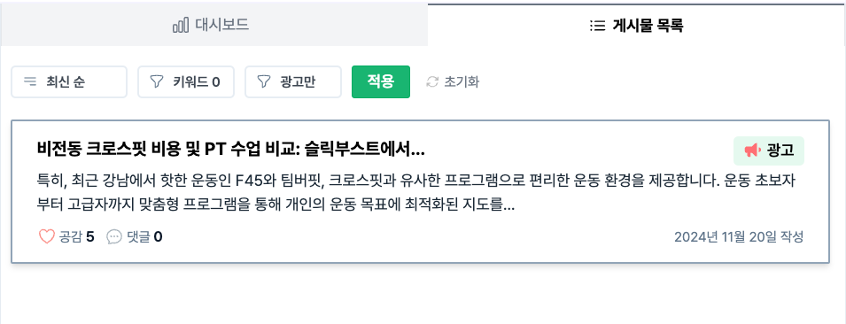
</figure>

<br>

<details>
  <summary>
    [기능 #1] 키워드간 게시물 트렌드 비교 (게시물, 광고글 수 / 좋아요, 댓글 수)
  </summary>
  <div markdown="1">

  <br/>

- 전반적인 소비자 반응을 파악할 수 있도록 시간에 따른 구체적인 지표를 제공합니다.
- 실제 업무에서 근거자료로 활용될 수 있기 때문에, 해당 지표는 수치로 증명 가능한 정보입니다.
- 차트 또한, 사용자가 업무 과정에서 작성할 리포트에 바로 첨부하여 사용할 수 있도록 UI를 구성하였습니다.

    <br/>

    </div>
  </details>

<details>
  <summary>
    [기능 #2] 키워드로 게시물을 필터링하고 정렬해요
  </summary>
  <div markdown="1">

  <br/>

- 공감, 댓글 많은 순으로 게시물들을 정렬할 수 있습니다.
- 불러온 게시물에서 추가로 특정 단어들을 포함, 제외한 게시물만 볼 수 있습니다.
- 게시물 리스트에서 광고 뱃지로 광고 게시물임을 알 수 있습니다. (하단 이미지 첨부)

    <br/>

    </div>
  </details>

<details>
  <summary>
    [비교/사용맥락] 네이버 블로그 검색 VS '블로블로' 서비스
  </summary>
  <div markdown="1">

  <br/>

- 네이버 블로그 검색은 일반 대중을 타겟으로 합니다. 한편 '블로블로'의 주요 타겟은 "브랜드 마케터"입니다.
- 따라서 `자사 브랜드 및 경쟁사/유사 브랜드 모니터링`이라는 특정 목적으로 사용자가 서비스를 이용한다는 맥락이 가장 큰 차이점입니다.

    <br/>

  |               | 네이버 블로그 검색                                                                                                                                                         | '블로블로'                                                                                                                                                                                                             |
  | ------------- | -------------------------------------------------------------------------------------------------------------------------------------------------------------------------- | ---------------------------------------------------------------------------------------------------------------------------------------------------------------------------------------------------------------------- |
  | **탐색 목적** | - 개인적인 이유, 계기로 검색을 이용합니다. <br> - 정확하고 원하던 게시물 1개라도 발견하면 대체로 니즈, 문제가 해결됩니다.                                                  | - 전반적인 동향이 궁금합니다. <br> - 포스팅 되는 게시물의 수, 경쟁 브랜드가 언급되는 수 트렌드의 수치가 궁금합니다.                                                                                                    |
  | **탐색 과정** | - 시간이 걸리더라도 합리적 결정이 중요하며 급하지 않습니다. <br> - 나와 유사한 상황의 글이 담긴 게시물을 찾습니다. <br> - 구매후기를 꼼꼼히 살피며 여러 옵션을 비교합니다. | - 내 회사 업무와 관련되며 마감기한이 있고 책임감이 상대적으로 큽니다. <br> - 제품/마케팅 액션 아이템을 도출할 인사이트를 발견하기를 기대합니다. <br> - 설득의 근거로 활용될 경우 숫자를 기반으로 한 근거가 필요합니다. |

    </div>
  </details>

<br/>

<br/>

# 2. 기술 스택

## 2-1. 기술 스택

<div>
  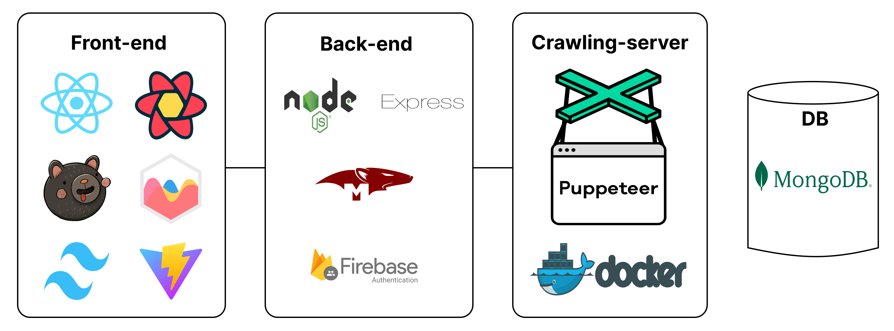
</div>
<br>

<table>
  <thead>
    <tr>
      <th width="25%">Frontend</th>
      <th width="25%">Backend</th>
      <th width="25%">Crawling-server</th>
      <th width="25%">Database</th>
    </tr>
  </thead>
  <tbody>
    <tr>
      <td>
        <li>React</li>
        <li>Zustand</li>
        <li>React Query</li>
        <li>Tailwind CSS</li>
        <li>Chart.js</li>
        <li>Vite</li>
      </td>
      <td>
        <li>Node.js</li>
        <li>Express</li>
        <li>Mongoose</li>
        <li>Firebase Authentication</li>
      </td>
      <td>
        <li>Puppeteer</li>
        <li>Docker</li>
      </td>
      <td>
        <li>MongoDB</li>
      </td>
    </tr>
  </tbody>
</table>
<br>

## 2-2. Zustand 전역 상태 관리

- 서비스 전반에 활용할 데이터, 연관성 높은 데이터를 컴포넌트간 효율적으로 공유하는 방법
  - 그룹 대시보드, 키워드 대시보드간 연관성이 높은 데이터를 공유하여 렌더링
  - 컴포넌트 구조가 깊어지면서 연관성이 높은 데이터를 어떻게 공유할지 고민이 생겼습니다.
  - 인접한 컴포넌트 지역 상태로 관리하고, 전역으로 활용이 필요한 아래 3가지를 전역 상태로 관리했습니다.
    1. 로그인한 사용자의 인증 정보
    2. 사용자의 그룹 및 키워드 정보
    3. 사용자에게 보여지는 모달 목록
- 복잡한 서버 상태 관리를 고려하여 클라이언트 상태 관리를 단순화하자.
  - 대시보드 서비스의 특성상 DB 데이터를 UI에 표기하고 상태로 관리하는 규모가 상대적으로 컸습니다.
  - 이렇게 서버 상태의 규모가 크고 복잡했기 때문에, 클라이언트 상태는 단순하고 가벼운 Zustand를 통해 사용하고자 했습니다.
  - 무엇보다 팀원 전원이 Zustand를 사용한 경험이 있어, 프로젝트 구현 및 일정 관리에 대한 변수를 줄일 수 있었습니다.

## 2-3. React Query 서버 상태 관리

- 자주 바뀌지 않지만 규모가 큰 데이터, 데이터 캐싱의 이점을 활용하다.
  - 저희 서비스가 제공하는 '그룹', '키워드', '키워드의 게시물' 데이터는 자주 변하지 않을 것이라고 판단했습니다.
  - 이렇게 변화 주기가 길고, 한 번 요청할 때 오가는 데이터의 양이 많기 때문에 데이터 캐싱의 이점을 활용하고자 했습니다.
  - 데이터 업데이트가 필요한 시점에만 쿼리를 무효화하여 불필요한 네트워크 요청을 방지했습니다.
- UI & 데이터 동기화로 신뢰를 만들다.
  - 만약 사용자가 새로운 그룹을 등록하거나, 게시물 목록 데이터가 추가되었는데 UI가 반영되지 않는다면 어떨까요?
  - 서비스의 데이터 마저 신뢰를 얻지 못할 것이고, 사용자는 이탈할 가능성이 높아질 것입니다. 저희 서비스로 제공하는 데이터 뿐 아니라, 신뢰도를 높일 수 있는 UX를 고민했습니다.
  - DB 변경사항이 발생하면, 각 그룹 및 키워드 대시보드의 차트들이 자동으로 업데이트되어 실시간성이 지켜지도록 했습니다.

<br>

# 3. 기능

<table>
  <tr>
    <td width="50%">
      <h3>로그인 / 로그인 없이 둘러보기</h3>
    </td>
    <td width="50%">
      <h3></h3>
    </td>
  </tr>
  <tr>
    <td width="50%">
      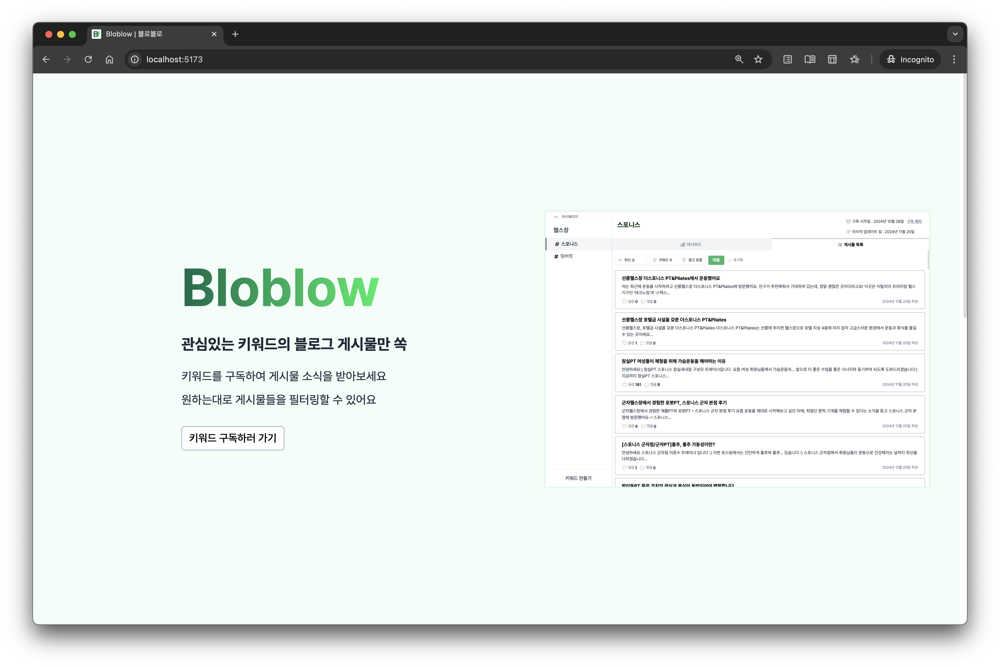
    </td>
    <td width="50%">

- 로그인
  - 구글 계정으로 로그인하여 서비스를 시작할 수 있습니다.
- 로그인 없이 둘러보기

  - 로그인 없이 샘플 대시보드를 확인할 수 있습니다.
  - 샘플 데이터 조회만 이용가능하며, 그외 기능은 로그인 후 이용가능합니다.

      </td>

      </tr>
      <tr>
          <td width="50%">
            <h3>마이 페이지</h3>
          </td>
          <td width="50%">
            <h3></h3>
          </td>
      </tr>
      <tr>
        <td width="50%">
          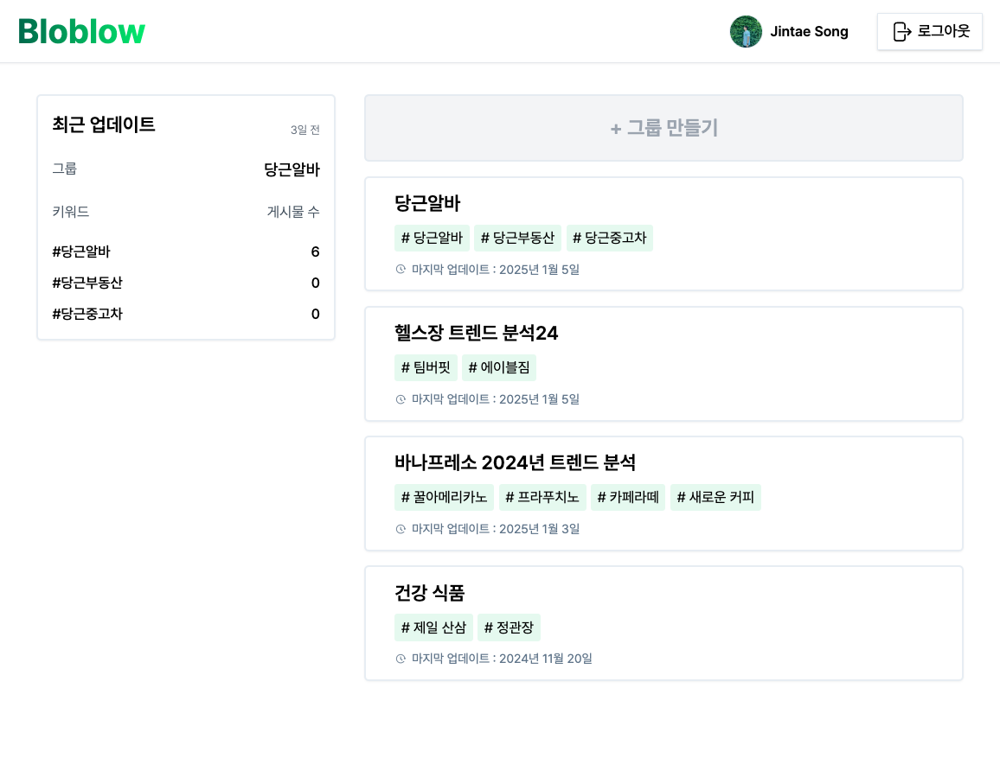
        </td>
        <td width="50%">
          <li>신규 그룹을 생성할 수 있습니다.</li>
          <li>최근에 업데이트된 그룹에 대한 간략한 정보를 확인할 수 있습니다.</li>
          <li>사용자가 등록한 그룹 목록이 각 그룹에 포함되어 있는 키워드 목록과 함께 표시됩니다.</li>
      </td>
    </tr>
    <tr>
      <td width="50%">
        <h3>그룹 차트</h3>
      </td>
      <td width="50%">
        <h3></h3>
      </td>
    </tr>
    <tr>
      <td width="50%">
      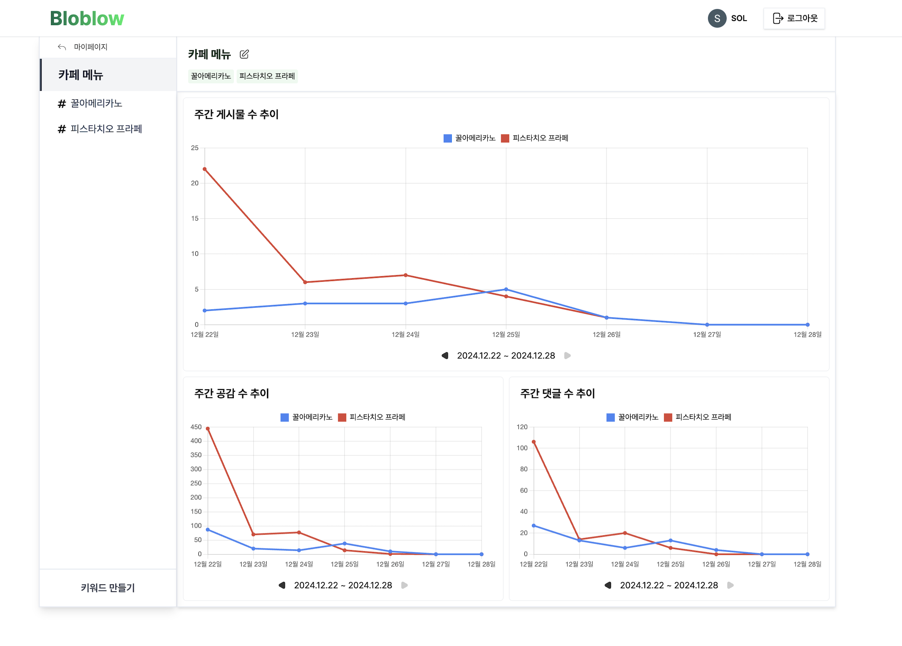
      </td>
      <td width="50%">

<li>키워드들의 게시물 수, 공감 수, 댓글 수의 추이를 비교할 수 있는 주간 차트가 표시됩니다.</li>
<li>해당 그룹에 포함할 신규 키워드를 생성할 수 있습니다.</li>
<li>그룹명을 수정할 수 있습니다.</li>

  </td>
</tr>
<tr>
  <td width="50%">
    <h3>키워드 차트</h3>
  </td>
  <td width="50%">
    <h3></h3>
  </td>
</tr>
<tr>
  <td width="50%">
    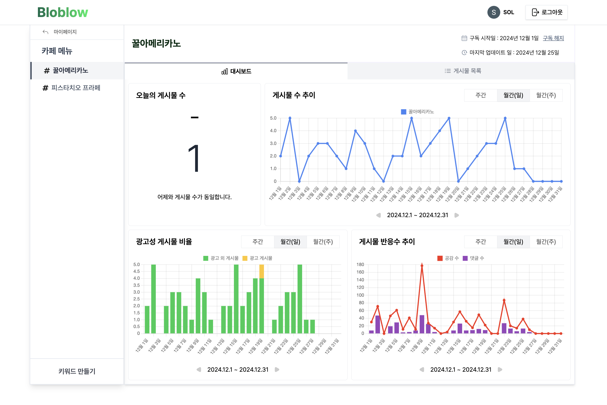
  </td>
  <td width="50%">

- 키워드에 대한 정보와 3가지 종류의 차트가 표시됩니다.
  - 게시물 수 추이
  - 광고성 게시물 비율 추이
  - 반응 수 추이
- 설정할 수 있는 기간은 주간, 월간의 일자, 월간의 주간으로 이루어져 있으며, 각 기간에 대한 차트 데이터를 확인할 수 있습니다.

  </td>
</tr>
<tr>
  <td width="50%">
    <h3>키워드 게시물 목록</h3>
  </td>
  <td width="50%">
    <h3></h3>
  </td>
</tr>
<tr>
  <td width="50%">
    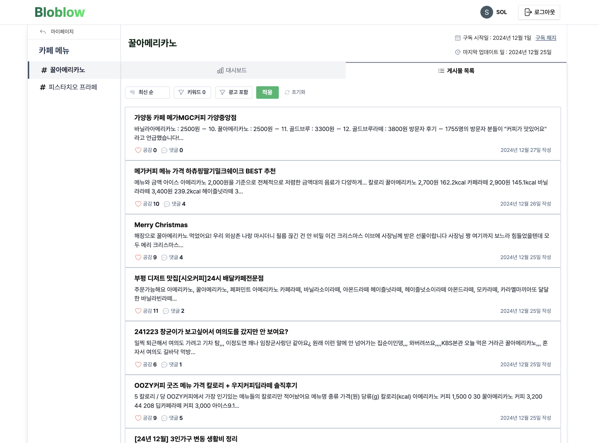
  </td>
  <td width="50%">

- 해당 키워드가 언급된 게시물 목록과 해당 게시물의 작성일, 공감 수, 댓글 수도 함께 확인할 수 있습니다.
- 필터를 통해 사용자가 원하는 조건이 설정된 게시물의 결과를 확인할 수 있습니다.
  - 정렬: 최신 순, 공감 많은 순, 댓글 많은 순
  - 키워드 필터: 포함 키워드, 제외 키워드
  - 광고 포함: 광고 포함, 광고만, 광고 제
- 해당 게시물을 클릭하면 새로운 창에서 해당 블로그 게시물이 표시됩니다.

    </td>

    </tr>
  </table>

<br>

# 4. 개발 과정

## 4-1. 크롤링을 사용하여 네이버 블로그 게시물을 가져오는 이유

> 크롤링(Crawling)이란, 웹 페이지 내 정보를 수집하여 가져오는 작업을 뜻합니다.

- 게시물의 본문뿐만 아니라 부가 정보(댓글 수, 공감 수 등)도 파악하기 위해 크롤링을 사용하게 되었습니다.

게시물의 크롤링 로직을 다음과 같이 구현하였습니다.

1. 네이버 검색 API를 통해 블로그 게시물의 URL 파악
2. puppeteer를 통해 해당 게시물 URL로 이동
3. 해당 게시물 내 iframe의 src 속성의 URL 파악
4. 파악한 URL로 이동
5. 해당 페이지에서 게시물의 본문 파악

크롤링을 사용하면서 게시물의 본문뿐만 아니라 댓글 수, 공감 수와 같은 게시물의 부가 정보 또한 가져올 수 있게 되어, 해당 정보를 활용하여 사용자에게 더 나은 인사이트를 제공할 수 있게 되었습니다.

<br>

<details>
  <summary>크롤링을 도입하게 된 계기</summary>
  <div markdown="1">
    <div>
      저희 서비스는 특정 키워드가 언급된 네이버 블로그 게시물을 모아 볼 수 있는 환경을 제공하여 마케터들에게 인사이트를 제공하는 것을 주된 목적으로 설정했습니다. 언급된 블로그만 제공하는 것이 아니라 더 많은 인사이트를 제공하기 위해 게시물의 본문을 활용하려 했습니다. 그러기 위해선 게시물 본문을 확보해야 했는데, 네이버 검색 API는 본문 전체가 아닌 본문 내에서 키워드가 언급된 단락만 전달해준다는 것을 파악하게 되었습니다. 크롤링을 사용하여 본문 뿐만 아니라 댓글 수, 공감 수 등과 같은 게시물의 부가 정보도 함께 파악하여 활용하기로 했습니다.
    <br>
    <br>
    Puppeteer라는 크롤링 라이브러리를 사용하여 네이버 검색 API에서 전달받은 게시물의 URL를 통해 게시물 본문을 크롤링하는 방법으로 구현했습니다.

  </div>
  </div>
</details>

<details>
  <summary>특이한 네이버 블로그 구조</summary>
  <div markdown="1">
    <div>
    구현을 하는 과정에서 본문 전체를 크롤링하기 위해 본문 전체를 감싸고 있는 선택자의 innerText를 파악하려 했으나 null이 반환되는 문제에 직면하게 되었습니다.
    <br>
    <br>
    아래와 같이 문제 상황에 대한 가정을 하여 해결하려 했습니다.
    <br>
    <br>
    - 컨텐츠가 완전히 로딩되기 전에 선택자의 innerText 파악하는 것.
    - 선택자 스펠링을 틀린 것.
    <br>
    <br>
    컨텐츠의 로딩이 완료된 후, 선택자의 innerText를 파악하거나 선택자 스펠링을 다시 확인해봤으나 결과는 같았습니다. API로 전달받은 블로그 게시물 URL를 통해 게시물의 HTML을 다시 파악해보니, 아래 첨부 이미지처럼 게시물 자체가 iframe 태그를 통해 표시되고 있단 것을 파악하게 되었습니다. 해당 iframe 태그의 src 속성값으로 게시물의 새로운 URL이 할당되어 있고, 네이버 블로그 주소 뒤에 해당 URL을 붙이면 같은 게시물이 표시되며 iframe 태그에 감싸여 있지 않은 구조인 것 또한 확인했습니다.
  </div>
  </div>
</details>

<details>
  <summary>두 URL의 HTML 구조 비교</summary>
  <div markdown="1">
    <table>
      <tr>
        <td>네이버 검색 API를 통해 전달받은 URL의 HTML 구조</td>
        <td>iframe 태그의 src속성 URL의 HTML 구조</td>
      </tr>
      <tr>
        <td>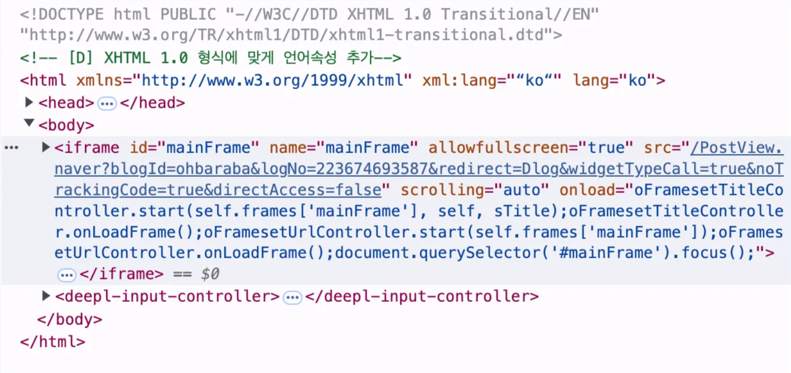</td>
        <td>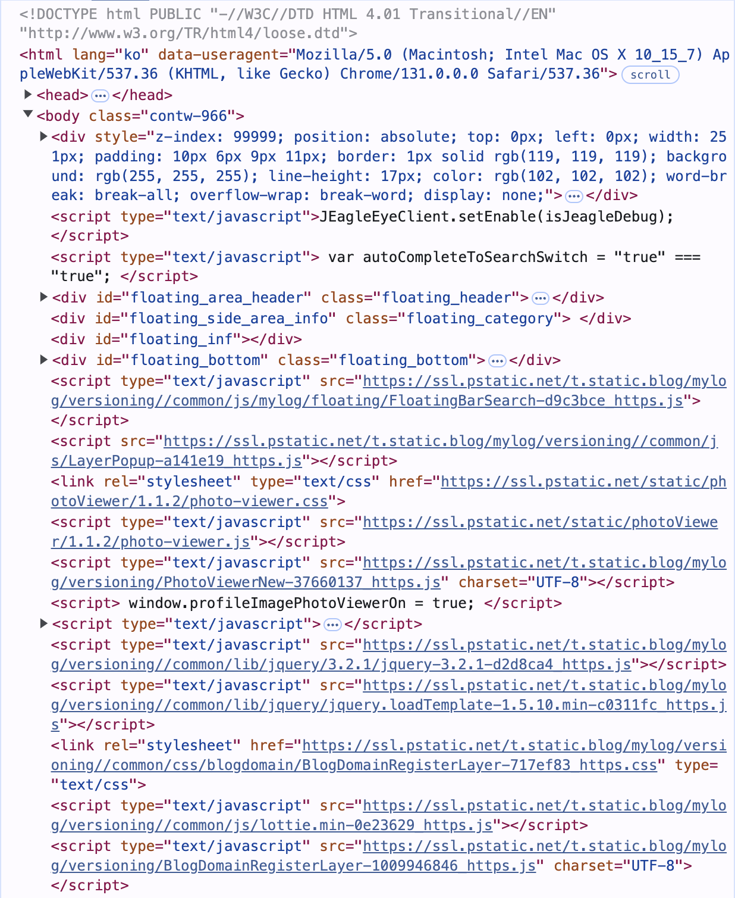</td>
      </tr>
    </table>
  </div>
</details>

<br>

## 4-2. 네이버 API 응답 내부의 `&amp;` 은 무엇이며 어떻게 필터링할까?

- `&amp;`은 HTML Entities입니다. HTML Entities는 HTML에서 특수문자를 안전하게 표현하기 위한 방식으로, `&amp;`는 &를, `&lt;`는 <를 의미합니다.
- 이를 처리하기 위해 HTML Entities를 디코딩하고 `<b>`와 같은 불필요한 태그를 제거하는 유틸리티 함수를 작성하여 깨끗한 텍스트를 반환하도록 했습니다.

<details>
  <summary>HTML Entities란?</summary>
  <div markdown="1">

<br />

**1. [Naver Blog API 응답에서 HTML Entities 처리하기]**

Naver Blog API를 사용하면서, 응답에 특수문자(예: `&amp;`나 `&lt;` )가 포함되어 해당 응답의 title과 description을 활용하는 PostCard 컴포넌트에 잘못된 텍스트가 표시되는 문제를 발견했습니다. 이를 조사한 결과, 이 특수문자들이 공통적으로 `&`로 시작하거나 HTML 태그와 비슷한 형태를 가지고 있었고, 이것이 **HTML Entities**라는 것을 알게 되었습니다.

**2. [HTML Entities란 무엇인가?]**

HTML Entities는 HTML에서 예약되거나 특수한 의미를 가지는 문자를 안전하게 표현하기 위해 사용됩니다. 예를 들어:

- `<`는 `&lt;`로 표현됩니다.
- `>`는 `&gt;`로 표현됩니다.
- `&`는 `&amp;`로 표현됩니다.

HTML Entities는 다음과 같은 이유로 사용됩니다.

1. HTML 구조 보호: `<`나 `>`와 같은 문자가 HTML 태그로 잘못 해석되는 것을 방지합니다. 만약 일반 텍스트에서 `<`나 `>`와 같은 문자를 그대로 사용할 경우, 브라우저가 이를 태그로 오인할 수 있습니다.
2. 보안: 특수문자가 HTML, JavaScript, CSS 코드로 해석되는 경우, 악성 코드 삽입(예: XSS 공격)의 위험이 있습니다. HTML Entities는 이러한 공격을 방지하기 위해 특수문자를 변환하여 브라우저가 실행 가능한 코드로 인식하지 않도록 보호합니다.
3. 호환성: 특수문자를 다양한 환경에서 일관되게 표현할 수 있도록 보장합니다.

<br />

  </div>
</details>

<details>
  <summary>HTML Entities를 디코딩하고 불필요한 태그를 제거하는 함수 코드</summary>
  <div markdown="1">

<br />

```js
const sanitizeHtmlEntity = (string) => {
  if (typeof string !== "string") {
    return "";
  }

  return string
    .replaceAll("<b>", "")
    .replaceAll("</b>", "")
    .replaceAll("&amp;", "&")
    .replaceAll("&lt;", "<")
    .replaceAll("&gt;", ">")
    .replaceAll("&nbsp;", " ")
    .replaceAll("&quot;", `"`)
    .replaceAll("&#035;", "#")
    .replaceAll("&#039;", `'`)
    .replaceAll("&sim;", "~");
};

export default sanitizeHtmlEntity;
```

  </div>
</details>

<br />

## 4-3. 서버 상태는 어떻게 관리할 수 있을까? 우리는 왜 React Query를 도입했는가?

- React Query 도입 이유: API 요청 상태(로딩, 성공, 실패) 관리의 반복적인 코드와 비효율성을 줄이고, 서버 상태를 간편하고 일관되게 관리하기 위해 React Query를 도입했습니다.
- React Query의 강점: 데이터 캐싱, Optimistic Updates, 비동기 작업의 통합 관리를 통해 네트워크 요청을 줄이고 사용자 경험을 개선하며, 복잡한 비동기 상태 관리를 단순화할 수 있었습니다.

<br />

| **항목**                    | **React Query 사용 전**                                                                               | **React Query 사용 후**                                                                                                     |
| --------------------------- | ----------------------------------------------------------------------------------------------------- | --------------------------------------------------------------------------------------------------------------------------- |
| **상태 관리의 복잡성**      | isLoading, isSuccess, isError, data, error 등 여러 개의 useState로 상태를 수동으로 관리해야 함        | isLoading, isError, data 등의 상태를 React Query가 자동으로 관리해줌                                                        |
| **반복적인 로직**           | API 호출 전 상태 초기화(setIsLoading(true) 등), 성공/실패 처리, 최종 상태 업데이트 등의 로직이 반복됨 | API 호출, 로딩/에러 처리, 상태 관리가 간단한 코드로 표현됨                                                                  |
| **의존적인 로직**           | useEffect 안에서 데이터를 가져오는 로직을 직접 작성해야 하며, 의존성 및 에러 핸들링 코드가 분산됨     | React Query 훅을 사용해 의존성 및 에러 핸들링을 간결하게 처리 가능                                                          |
| **서버 데이터 동기화 문제** | 데이터가 갱신될 때 수동으로 추가적인 로직을 작성해야만 함                                             | staleTime, cacheTime 등을 활용해 캐싱 및 네트워크 요청을 최적화하고, invalidateQueries로 데이터 동기화를 자동으로 처리 가능 |

<br />

<details>
  <summary>React Query를 도입한 이유</summary>
  <div markdown="1">

<br />

팀 프로젝트를 시작하며, 우리는 코드를 효율적이고 통일된 방식으로 작성하고, 유저에게 자연스러운 UI를 노출시키는 방법을 고민했습니다. 이러한 고민은 서버와의 비동기 통신(HTTP 통신)에서도 마찬가지였습니다. 구체적으로는 크롤링 및 스크래핑 작업에서의 로딩 상태, 성공 여부, 실패 여부를 어떻게 일관성 있게 관리할지, 그룹 생성 후 그룹 리스트 데이터를 어떻게 서버와 자연스럽게 동기화할지 등이 있었습니다.

React Query를 도입하지 않았다면, API 요청 핸들링을 위해 직접 커스텀 훅을 작성하거나, 매번 새로운 서버 상태(Server State)를 수동으로 관리해야 했을 것입니다. 이러한 방식은 비슷한 로직의 반복으로 코드 중복을 야기할 수 있습니다. 또한, 여러 상태의 초기화 및 에러 처리, 로딩 상태 관리 등의 작업은 꽤 번거롭습니다. 페이지가 로드되거나 특정 컴포넌트가 마운트 될 때, 유저에게 즉각적으로 보여주고 싶은 데이터가 있다면, useEffect를 사용해 데이터를 불러와야 합니다. 그리고 특정 mutation 요청이 완료된 직후 서버 데이터를 다시 가지고 오려면 위와 같이 조건에 따른 추가적인 로직을 작성해야만 합니다.

React Query를 도입함으로써 우리는 중복된 코드와 상태를 줄이며 서버 상태를 관리할 수 있었습니다. 특히, 데이터베이스에서의 Create/Update/Delete와 같은 mutation 작업 후에도 간단히 최신 데이터를 동기화(fetching)하거나, 에러 처리하는 코드를 작성할 수 있었습니다.

뿐만 아니라, 다음과 같은 React Query의 강점들이 프로젝트에 큰 도움이 되었습니다.

- **자동화된 데이터 캐싱**: 동일한 데이터를 반복적으로 요청하지 않도록 설정된 시간(staleTime) 동안 캐싱을 활용해 네트워크 요청을 줄일 수 있었습니다.
- **Optimistic Updates**: Mutation 작업 시, UI를 즉각적으로 업데이트하여 사용자 경험(UX)을 개선할 수 있었습니다.
- **비동기 작업의 통합 관리**: 데이터 fetching, 캐싱, 동기화, 에러 처리와 같은 비동기 작업을 React Query의 통일된 인터페이스로 쉽게 관리할 수 있었습니다.

결국, React Query는 서버 상태 관리를 단순화하고, 데이터 가져오기(fetching), 캐싱(caching), 동기화(synchronization), 그리고 업데이트(update) 작업을 효율적으로 처리할 수 있는 강력한 도구입니다. 이를 통해 비동기 상태 관리의 복잡성을 줄이고, 비즈니스 로직과 사용자 경험 개선에 집중할 수 있었습니다.

<br />

  </div>
</details>

<details>
  <summary>React Query 사용 전후의 비교: API 요청 상태 관리 및 페이지 로드 시 데이터 불러오는 코드</summary>
  <div markdown="1">

<br />

**1. [React Query 사용 전]**

```jsx
const [isLoading, setIsLoading] = useState(false);
const [isSuccess, setIsSuccess] = useState(false);
const [isError, setIsError] = useState(false);
const [data, setData] = useState(null);
const [error, setError] = useState(null);

useEffect(() => {
  const fetchData = async () => {
    setIsLoading(true);
    setIsSuccess(false);
    setIsError(false);
    setError(null);

    try {
      const response = await apiFunction();

      if (response.ok) {
        const parsedResponse = await response.json();

        setData(parsedResponse);
        setIsSuccess(true);
      } else {
        const errorMessage = await response.text();

        throw new Error(`Error ${response.status}: ${errorMessage}`);
      }
    } catch (error) {
      setIsError(true);
      setError(error.message);

      console.error(`Fetch error: ${error.message}`);
    } finally {
      setIsLoading(false);
    }
  };

  fetchData();
}, []);
```

**2. [React Query 사용 후]**

```jsx
const { data, isError, isPending, isSuccess } = useQuery('data', fetchData);

if (isError) {
  return <div>Error occurred</div>;
}

if (isPending) {
  return <div>Loading...</div>;
}
```

**3. [실제 코드]**

```jsx
const setUserGroupList = useBoundStore((state) => state.setUserGroupList);
const userUid = useBoundStore((state) => state.userInfo.uid);
const hasUserUid = !!userUid;

**const { data: userGroupList, isError, isPending } = useQuery({
  queryKey: ["userGroupList", userUid],
  queryFn: () => asyncGetUserGroup(userUid),
  enabled: hasUserUid,
});**

if (isError || userGroupList?.message?.includes("Error occured")) {
  return (
    <div className="flex flex-center w-full h-full">
      에러가 발생하였습니다. 잠시 후 다시 시도해주시기 바랍니다.
    </div>
  );
}

if (userGroupList?.groupListLength === 0) {
  return <div className="flex flex-center w-full h-full">생성한 그룹이 없습니다</div>;
}

if (hasUserUid && userGroupList?.groupListResult?.length > 0) {
  setUserGroupList(userGroupList?.groupListResult);
}
```

  </div>
</details>

<details>
  <summary>React Query 사용 전후의 비교: DB mutation 이후, 서버 데이터 동기화에 대한 코드</summary>
  <div markdown="1">

<br />

**1. [React Query 사용 전]**

```jsx
const [isLoading, setIsLoading] = useState(false);
const [isSuccess, setIsSuccess] = useState(false);
const [isError, setIsError] = useState(false);
const [error, setError] = useState(null);

const handleButtonClick = async (mutationPayload) => {
  setIsLoading(true);
  setIsSuccess(false);
  setIsError(false);
  setError(null);

  try {
    const response = await fetch("/api/mutate", {
      method: "POST",
      headers: { "Content-Type": "application/json" },
      body: JSON.stringify(mutationPayload),
    });

    if (response.ok) {
      fetchData(); // Mutation 성공 후 서버 데이터 동기화
      setIsSuccess(true);
    } else {
      const errorMessage = await response.text();
      throw new Error(`Error ${response.status}: ${errorMessage}`);
    }
  } catch (error) {
    setIsError(true);
    setError(error.message);
    console.error(`Mutation error: ${error.message}`);
  } finally {
    setIsLoading(false);
  }
};
```

**2. [React Query 사용 후]**

```jsx
const queryClient = useQueryClient();

const mutation = useMutation({
  mutationFn: (mutationPayload) => asyncMutate(mutationPayload),
  onSuccess: () => {
    /* .. */
  },
  onError: () => {
    /* .. */
  },
});

const handleButtonClick = (mutationPayload) => {
  mutation.mutate(mutationPayload, {
    onSuccess: () => {
      queryClient.invalidateQueries({ queryKey: ["data"] });
    },
    onError: () => {
      /* .. */
    },
  });
};

const { isPending, isError, isSuccess } = mutation;
```

**3. [실제 코드]**

```jsx
const queryClient = useQueryClient();

const createKeywordMutation = useMutation({
  mutationFn: (keywordInfo) => asyncPostKeyword(keywordInfo),
});

const handleKeywordSubmit = (e) => {
  e.preventDefault();

  /* ... */

  createKeywordMutation.mutate(keywordInfo, {
    onSuccess: (data) => {
      if (data?.message?.includes("Error occured")) {
        addModal(MODAL_TYPE.ERROR);
        return;
      }

      closeModal(MODAL_TYPE.CREATE_KEYWORD);
      addModal(MODAL_TYPE.CREATE_KEYWORD_SUCCESS);
      queryClient.invalidateQueries({ queryKey: ["userGroupList", data.ownerUid] });
    },
    onError: () => {
      addModal(MODAL_TYPE.ERROR);
    },
  });
};**

const isPending = createKeywordMutation.isPending;
```

  </div>
</details>

<br>

## 4-4. 모달을 root DOM node에서 분리하여 렌더링 시킬 수 있는 방법은 없을까?

- 문제 해결 방법: `react-dom`의 `createPortal` API와 독립적인 `#modal` DOM 계층을 도입하여, 모달을 기존 `#root`와 분리된 DOM 트리에 렌더링하도록 구현했습니다.
- 얻은 효과: 스타일링 충돌 방지와 포지셔닝 문제를 해결하고, 모달을 독립적으로 관리할 수 있어 유지보수성이 향상됩니다.

<details>
  <summary>Root DOM node 내부에서 모달 렌더링 시 발생 가능한 문제점</summary>
  <div markdown="1">

<br />

모달은 많은 웹 애플리케이션에서 흔히 볼 수 있는 기능입니다. 현재 페이지에서 벗어나지 않고도 컨텍스트를 분리하여 사용자를 집중 시킴으로써 정보를 표시하거나 입력을 수집할 수 있는 간단한 방법이기 때문입니다. 따라서, 당연하게도 저희 프로젝트에도 UI/UX를 위하여 모달을 사용하였습니다.

프로젝트 진행 중에 모달을 DOM 내부의 기존 `#root` 노드에서 렌더링하면서 다소 염려가 되는 점이 있었고, 해당 부분에 대해서 설명하고자 합니다.

**1. [스타일링 충돌]**

- 아래 예시 코드에서 모달은 root DOM node 내부의 Profile 컴포넌트의 자식이기 때문에 Profile 컴포넌트에 적용되는 모든 CSS가 모달에 영향을 줄 수 있습니다. 따라서 모달을 독립적으로 스타일링하기 어려울 수 있습니다.

```jsx
function Dashboard() {
  return (
    <div>
      <h1>Dashboard</h1>
      <Profile />
    </div>
  );
}

function Profile() {
  return (
    <div>
      <h2>Profile</h2>
      <button>View More</button>
      <Modal />
    </div>
  );
}
```

**2. [포지셔닝]**

- 모달은 일반적으로 다른 콘텐츠 위에 표시되도록 absolute position 또는 fixed position으로 배치됩니다. 그러나 만약 모달의 부모 요소에 CSS position이 설정되어 있는 경우(정적이 아닌 경우) 모달은 전체 페이지가 아닌 해당 요소에 의한 상대적인 위치로 지정될 수 있습니다.

  </div>
</details>

<details>
  <summary>Portal과 독립적인 #modal root 도입</summary>
  <div markdown="1">

<br />

1. **독립적인 DOM 계층에서 렌더링**

   - `index.html`에 `<div id="modal"></div>`를 추가하여, 모달이 기존 `#root` DOM 구조와 분리된 독립적인 계층에서 렌더링되도록 했습니다.
   - `createPortal`을 사용해 React의 컴포넌트 트리와는 독립적으로 DOM 트리 상의 `#modal` 노드에 모달을 렌더링하도록 구현했습니다. 따라서, Modal 컴포넌트를 DOM의 어느 곳에나 배치 가능합니다. React 컴포넌트 트리에서는 Modal 컴포넌트가 배치된 곳에 위치하지만 실제 DOM 트리에서는 그렇지 않게 됩니다.

2. **스타일링 충돌 방지**

   - 모달이 부모 DOM의 스타일 속성 영향을 받지 않으므로, `position`, `z-index` (쌓임 맥락)와 같은 속성으로 인한 CSS 충돌 문제로부터 자유롭습니다.
   - 항상 화면 최상단에 모달이 표시되도록 보장할 수 있게 되었습니다.

3. **포지셔닝**
   - 모달은 DOM에서 body의 direct child이기 때문에 전체 페이지에 대해 상대적인 위치를 지정할 수 있습니다.

```jsx
// index.html

<!doctype html>
<html lang="ko">
  <head>
    <!-- ... -->
  </head>
  <body>
    <div id="root"></div>
    <div id="modal"></div>
  </body>
</html>
```

```jsx
// Portal.jsx
import { createPortal } from "react-dom";

import PropTypes from "prop-types";

const Portal = ({ children, currentRef }) => {
  const modalDivElement = document.getElementById("modal");

  return currentRef ? createPortal(children, currentRef) : createPortal(children, modalDivElement);
};

export default Portal;

Portal.propTypes = {
  children: PropTypes.node.isRequired,
  currentRef: PropTypes.node,
};
```

```jsx
const AlertModal = ({ alertMessage, destination }) => {
  const closeModal = useBoundStore((state) => state.closeModal);

  const handleConfirmClick = () => {
    closeModal(MODAL_TYPE.ALERT);
  };

  return (
    <Portal>
      <ModalBackground isClear={false} modalType={MODAL_TYPE.ALERT}>
        <ModalFrame isClear={false} hasCloseButton={false} modalType={MODAL_TYPE.ALERT}>
          <main className="flex flex-col items-center"></main>
        </ModalFrame>
      </ModalBackground>
    </Portal>
  );
};

export default AlertModal;
```

<br />

  </div>
</details>

<br>

## 4-5. 모달을 전역적으로 어떻게 관리하면 좋을까?

- 전역 상태 관리 방식: 모달의 종류를 배열로 관리하여, 모달의 타입이 배열에 포함되는지 확인해 렌더링하도록 구현했습니다. 이를 통해 개별 boolean 값으로 관리하는 비효율성을 해소하고, 다중 모달 관리가 용이해졌습니다.
- 구현 효과: 모달 상태를 통합적으로 관리함으로써 확장성이 향상되었습니다. 동시에 여러 모달을 열거나, 특정 순서로 모달을 표시하는 기능을 간단히 구현할 수 있습니다.

<details>
  <summary>모달 관리와 렌더링 코드</summary>
  <div markdown="1">

<br />

모든 모달을 개별적인 상태로 관리하기에는 모달의 종류가 많아짐에 따라 상태도 늘어나기에, 확장성이 없다고 느껴졌습니다. 그리고 여러 모달을 동시에 열어야 하는 상황에서는 개별 `boolean` 값으로 관리하는 방식이 비효율적이라고 생각되었습니다. 따라서 아래와 같이 모달의 타입이 배열 안에 있고 없음을 따져서 렌더링 되도록 구현하였습니다. 아래의 방법이 모달 위에 모달을 띄우는 다중 모달 관리 및 특정 모달을 조건에 따라 쉽게 교체하거나 추가하는데에도 용이하다고 생각했습니다.

```jsx
const createModalSlice = (set) => ({
  openModalTypeList: [],
  addModal: (modalType) =>
    set((state) => ({ ...state, openModalTypeList: [...state.openModalTypeList, modalType] })),
  closeModal: (modalType) =>
    set((state) => ({
      ...state,
      openModalTypeList: state.openModalTypeList.filter((name) => name !== modalType),
    })),
  clearOpenModalTypeList: () => set((state) => ({ ...state, openModalTypeList: [] })),
});
```

```jsx
const MyPageSidebar = () => {
  const addModal = useBoundStore((state) => state.addModal);
  const openModalTypeList = useBoundStore((state) => state.openModalTypeList);

  const handleCreateKeywordButton = () => {
    addModal(MODAL_TYPE.CREATE_KEYWORD.DEFAULT);
  };

  return (
    <aside>
      <Button onClick={handleCreateKeywordButton}>키워드 만들기</Button>
      {openModalTypeList.includes(MODAL_TYPE.CREATE_KEYWORD.DEFAULT) && (
        <CreateKeywordModal createType={MODAL_TYPE.CREATE_KEYWORD.MY_PAGE} />
      )}
      {openModalTypeList[openModalTypeList.length - 1] === MODAL_TYPE.CREATE_KEYWORD_SUCCESS && (
        <CreateKeywordSuccessModal />
      )}
      {openModalTypeList[openModalTypeList.length - 1] === MODAL_TYPE.ERROR && (
        <ErrorModal errorMessage={ERROR_MESSAGE.CREATE_KEYWORD_ERROR} />
      )}
    </aside>
  );
};
```

  </div>
</details>

<br>

## 4-6. 협업을 위한 로직 재사용성과 관심사 분리를 위해 커스텀 훅을 만들어볼까?

- 문제 해결 방법: 컴포넌트에 혼재된 비즈니스 로직과 UI를 분리하고, 공통 로직을 커스텀 훅으로 캡슐화하여 재사용성과 유지보수성을 높였습니다. 이를 통해 코드 중복을 줄이고, 협업 시 코드 가독성과 효율성을 향상시켰습니다.
- 구현 효과: 커스텀 훅으로 로직을 중앙 관리함으로써 팀원 간 일관성을 유지하고, 로직 수정 시 여러 파일을 일일이 수정하지 않아도 되는 확장성과 편의성을 확보했습니다.

<details>
  <summary>커스텀 훅의 사용 이유와 목적</summary>
  <div markdown="1">

<br />

팀 프로젝트 진행 중, 컴포넌트 내부의 점점 늘어나는 로직으로 인한 코드 복잡성을 직면하면서 협업의 효율성을 생각하지 않을 수 없었습니다. 여러 컴포넌트에서 동일하거나 유사한 로직을 반복적으로 구현하면서 코드가 중복된다는 것이 직접적으로 느껴졌고, 이는 유지보수성을 떨어뜨렸습니다. 실제로 중복이 일어나지 않았더라도, 해당 로직을 추후에 나 뿐만이 아닌 다른 팀원들이 재사용 할 수 있을 것이라 생각이 들기도 했습니다.

각 함수형 컴포넌트에 UI 뿐 아니라 여러 로직이 혼재되어 있어 코드의 가독성이 낮아지는 것을 발견했습니다. 이로 인해, 다른 팀원이 코드를 읽으며 이해하는 시간이 증가될 것이라 생각이 되었습니다. 물론 PR 리뷰 시간도 마찬가지입니다. 또, 특정 로직을 수정하거나 확장하려면 여러 파일을 개별적으로 모두 수정해야 하는 상황이 발생했습니다.

우리는 이러한 문제를 해결하기 위해 **로직의 재사용성과 관심사의 분리**를 목표로 설정했습니다. React의 철학인 **컴포지션(Composition)** 패턴에 따라 비즈니스 로직을 UI 컴포넌트에서 분리하고, 이를 캡슐화한 재사용 가능한 형태로 관리하기 위해 커스텀 훅(Custom Hook)을 적극 사용하기로 했습니다. 즉, 커스텀 훅으로 특정 로직과 상태를 캡슐화하여 어떻게 내부의 복잡한 로직이 구성되어 있는지는 숨기고, 외부로는 무엇을 할 수 있는지만 보여줌으로써 코드 복잡성을 감소시키고 로직의 재사용성을 증가시킴으로써 협업의 효율을 높였습니다.

- 코드 중복 제거: 여러 컴포넌트에서 동일한 로직을 반복하지 않고, 하나의 훅으로 관리할 수 있었습니다.
- 관심사의 분리: UI 렌더링은 컴포넌트가 담당하고, 비즈니스 로직은 커스텀 훅으로 분리하여 컴포넌트의 역할과 코드의 가독성을 명확히 할 수 있었습니다.
- 협업 효율성 향상: 로직이 중앙에서 관리되면서 팀원들 간 코드 일관성을 유지할 수 있었고, 새로운 기능 추가나 기존 로직 수정 시 훅만 수정하면 되어 유지보수 작업이 훨씬 간소화되었습니다.

  </div>
</details>

<details>
  <summary>모달 마운트 시 백그라운드 레이어의 스크롤 방지 커스텀 훅 코드</summary>
  <div markdown="1">

<br />

- 간단하게 `overflow: hidden`을 설정하는 로직과는 다르게 `position: fixed`와 동시에 스크롤이 있는 경우, `overflow-y: scroll`로 기존 스크롤을 유지해 Layout shift 방지
- 모달이 언마운트될 경우, 클로저를 활용한 scrollY 변수로 스크롤 위치 복원

```jsx
const useScrollDisable = () => {
  useEffect(() => {
    const scrollY = window.scrollY;
    const hasScroll = document.documentElement.scrollHeight > document.documentElement.clientHeight;

    document.body.style.cssText = `
      position: fixed;
      top: -${scrollY}px;
      left: 0;
      right: 0;
      ${hasScroll && "overflow-y: scroll;"}
    `;

    return () => {
      document.body.style.cssText = "";
      window.scrollTo(0, scrollY);
    };
  }, []);
};
```

  </div>
</details>

<details>
  <summary>React Query의 useInfiniteQuery를 활용한 무한스크롤 관련 커스텀 훅 코드</summary>
  <div markdown="1">

<br />

```jsx
const useInfiniteData = ({
  queryKey,
  queryFn,
  options,
  initialPageParam,
  getNextPageParam,
  ref,
}) => {
  const { data, status, fetchNextPage, isPending, isFetchingNextPage, isError, ...rest } =
    useInfiniteQuery({
      queryKey,
      queryFn: ({ pageParam }) => queryFn(pageParam, options),
      initialPageParam,
      getNextPageParam,
    });

  const onIntersect = (entries) => {
    if (isPending) return;
    if (!data?.pages[data?.pages.length - 1].hasNext) return;

    entries.forEach((entry) => {
      if (entry.isIntersecting) {
        fetchNextPage();
      }
    });
  };

  useObserver({ target: ref, threshold: 1.0, onIntersect });

  return { data, status, fetchNextPage, isPending, isError, isFetchingNextPage, ...rest };
};
```

```jsx
const PostCardList = ({ keywordId, filterList, setFilterList, resetFilterList }) => {
  const observeRef = useRef(null);

  const infiniteDataArgument = {
    queryKey: ["posts", keywordId, filterList],
    queryFn: asyncGetPosts,
    options: {
      keywordId,
      order: filterList.order,
      includedKeyword: filterList.includedKeyword,
      excludedKeyword: filterList.excludedKeyword,
      isAd: filterList.isAd,
      limit: 5,
    },
    initialPageParam: "",
    getNextPageParam: (lastPage) => (lastPage.hasNext ? lastPage.nextCursorId : undefined),
    ref: observeRef,
  };

  const {
    data: postResponse,
    isPending,
    isFetchingNextPage,
    isError,
  } = useInfiniteData(infiniteDataArgument);
```

  </div>
</details>
   
<details>
  <summary>무한스크롤 관련 Intersection Observer 로직을 위한 커스텀 훅 코드</summary>
  <div markdown="1">

<br />

- Intersection Observer API

```jsx
const useObserver = ({
  target,
  root = null,
  rootMargin = "0px 0px 0px 0px",
  threshold = 1.0,
  onIntersect,
}) => {
  useEffect(() => {
    let observer;

    if (target && target.current) {
      observer = new IntersectionObserver(
        (entries, observer) => {
          onIntersect(entries, observer);
        },
        {
          root,
          rootMargin,
          threshold,
        }
      );

      observer.observe(target.current);
    }

    return () => {
      if (observer) {
        observer.disconnect();
      }
    };
  }, [target, root, rootMargin, threshold, onIntersect]);
};
```

  </div>
</details>

<br>

# 5. 사용자 편의성 개선

## 5-1. 블로그 게시물을 크롤링하는 시간 줄이기

- Promise.allSettled를 사용하여 병렬로 크롤링을 진행하며, 한 번에 크롤링을 진행하는 게시물 수를 줄여 크롤링하는 데 걸리는 소요 시간을 줄였습니다.
- Promise.allSettled를 통해 병렬 처리뿐만 아니라 크롤링 중 발생할 수 있는 에러에 대한 처리도 할 수 있게 되었습니다.

<br>

<details>
  <summary>[시도 #1] 게시물 수를 줄여서 요청하기</summary>
  <div markdown="1">
소요 시간을 줄이기 위해 네이버 검색 API의 검색 결과 개수를 다르게 한 후 크롤링을 시도해본 결과,

- 100개 게시물을 검색한 후 크롤링하는 데 걸리는 시간 : 약 3분 49초 소요 (약 229초 소요)
- 10개 게시물을 검색한 후 크롤링하는 데 걸리는 시간 : 약 24초 소요

게시물 개수를 다르게 하여도 유의미한 속도 차이가 발생하지 않는다는 것을 확인할 수 있었습니다.

  </div>
</details>

<details>
  <summary>[시도 #2] 병렬로 크롤링하기</summary>
  <div markdown="1">
기존 직렬로 진행했던 방식을 병렬로 진행할 수 있도록 `Promise.all`을 사용하여 네이버 검색 API의 검색 결과 개수를 다르게 한 후 크롤링을 시도해본 결과,

- 10개 게시물을 검색한 후 `Promise.all`을 사용하여 크롤링하는 데 걸리는 시간 : 약 12초
- 15개 게시물을 검색한 후 `Promise.all`을 사용하여 크롤링하는 데 걸리는 시간 : 약 23초
- 20개 게시물을 검색한 후 `Promise.all`을 사용하여 크롤링하는 데 걸리는 시간 : 약 34초

이러한 결과가 도출되었으며, 게시물 수가 5개 증가함에 따라 시간은 약 11초가 증가한다는 것을 파악할 수 있었습니다. 크롤링 속도를 줄이는 방법으로 블로그 게시물 10개씩 요청하여 크롤링을 진행하는 방식을 택하였습니다.

  </div>
</details>

<details>
  <summary>[시도 #3] Promise.all과 Promise.allSettled</summary>
  <div markdown="1">
`Promise.all`로 크롤링 테스트를 진행하던 중, 네이버 검색 API를 통해 전달받은 검색 결과 내 외부 블로그 게시물이 포함되어 있어 크롤링이 완료되지 못한 문제가 발생하였습니다. 크롤링 시작하기 전에 네이버 블로그가 아닌 경우 제외하는 예외 처리만 추가할 수 있었지만, 예상하지 못한 문제들이 발생할 수 상황을 고려해야 했습니다.

따라서, 요청한 10개의 게시물 크롤링 요청 도중 하나의 크롤링에서 오류가 발생하면 모든 크롤링 작업이 멈추게 되는 `Promise.all`을 택하기보단 개별 크롤링 작업에 대한 결과가 포함되어 반환되는 `Promise.allSettled`를 택하였습니다.

  </div>
</details>

<br>

## 5-2. 구독을 시작했을 때 언제 등록된 게시물부터 보여주는 것이 좋을까?

- 당일에 등록된 게시물을 당일에 크롤링하는 기능의 통일성을 유지하기 위해 구독한 날로부터 당일에 등록한 게시물에 대해서만 보여주고 있습니다.

저희는 아이디어 단계에서 특정 키워드에 대해 언급된 모든 블로그 게시물에 대하여 모니터링이 가능한 서비스로 구상했기 때문에, 기획 단계에서 구독을 시작한 후뿐만 아니라 구독 이전의 게시물에 대해서도 모니터링이 할 수 있도록 구체화했습니다.

네이버 검색 API의 응답을 통해 블로그 게시물을 등록한 날짜(postdate)를 전달받기 때문에 특정 날짜까지 등록된 게시물들을 조회하여 개발을 진행하고자 했습니다. 그러나 네이버 검색 API에서 제공해주는 파라미터 중 게시물을 등록한 날짜를 설정할 수 있는 파라미터가 없다는 문제에 직면하게 되었습니다.

네이버 검색 API를 통해 전달받은 블로그 게시물 링크(`link`)를 사용하여 해당 게시물 본문을 크롤링하는 과정을 구독한 당일에 게시된 게시물뿐만 아니라 구독 이전의 특정 날짜까지 등록된 게시물까지 모두 반복해야 한다는 것뿐만 아니라 크롤링의 속도가 저희 생각보다 오래 걸린다는 문제에도 직면하게 되었습니다.

이와 같은 문제로 팀원들 간에 여러 의견이 다음과 같이 나뉘었습니다.

1. 오랜 시간이 소요되더라도 사용자에게 많은 콘텐츠를 보여주기 위해 구독 이전일 게시물도 함께 보여주자.
2. 더 많은 콘텐츠를 보여주기 위해 사용자가 오랜 시간을 대기해야 하는 것보다는 구독 시작한 날 등록된 게시물만 보여주자.

저희 서비스의 기능인 당일에 등록된 게시물을 당일에 크롤링하는 것을 생각한다면, 당일에 등록되지 않은 게시물을 크롤링하는 것은 기획 의도와 맞지 않는다고 판단하여 구독한 날로부터 당일에 등록한 게시물에 대해서만 크롤링하는 것으로 결정하게 되었습니다.

<details>
  <summary>네이버 검색 API 응답 구조 (키워드 예시: 아메리카노)</summary>
  <div markdown="1">

```jsx
//키워드를 "아메리카노"로 설정한 네이버 검색 API 응답 구조

{
  "lastBuildDate": "Tue, 24 Dec 2024 15:20:22 +0900",
  "total": 10595970,
  "start": 1,
  "display": 10,
  "items": [
    {
      "title": "동탄호수공원  베이커리 카페 다정베이커리는 <b>아메리카노</b> 행사중",
      "link": "https://blog.naver.com/ohbaraba/223674693587",
      "description": "동탄호수공원 베이커리 카페 다정베이커리는 <b>아메리카노</b> 행사중 이 자리에 애견동반 초록초록한... 구입시 <b>아메리카노</b> 무료 쿠폰 준다는거 보고 갔음 12/19일 까지였던 듯!!! 동탄호수공원 베이커리 카페... ",
      "bloggername": "오박이네 ^0^",
      "bloggerlink": "blog.naver.com/ohbaraba",
      "postdate": "20241130"
    }
  ]
}
```

  </div>
</details>

<details>
  <summary>네이버 검색 API 파라미터 종류</summary>
  <div>
    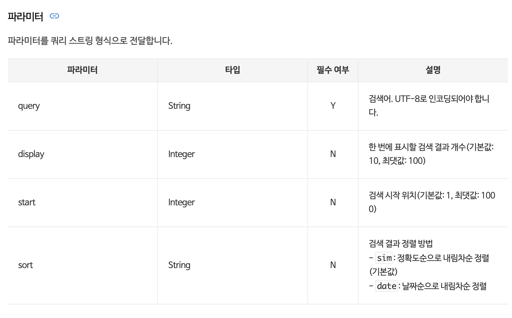
  </div>
</details>

<br>

## 5-3. 게시물 목록에서 광고성 글을 바로 확인할 수 있도록, 크롤링 직후에 미리 선별해두자.

- 광고성 문구들을 `array` 타입으로 사전에 정의하고, 게시물 본문 HTML 태그를 분석하여 광고성 글을 분류하였습니다.
  - 광고성 문구 예시 : "소정의 원고료를 받고 작성한 글입니다"
- 광고성 문구를 이미지로 첨부한 게시물에 대한 처리를 추가할 예정입니다.
  - 사전 조사 과정에서 광고성 문구를 텍스트로 표기한 케이스가 약 70%로 확인하여 텍스트 검사 로직을 먼저 구현했습니다.

```jsx
// 광고성 게시물로 분류할 수 있는 주요 키워드
const validateAdKeyword = [
  "소정의 원고료",
  "소정의 수수료",
  "수수료를 지급받아",
  "원고료를 지급받아",
];

/* ... */

const isAd = await Promise.resolve(
  validateAdKeyword.some((adKeyword) => content.includes(adKeyword))
);
```

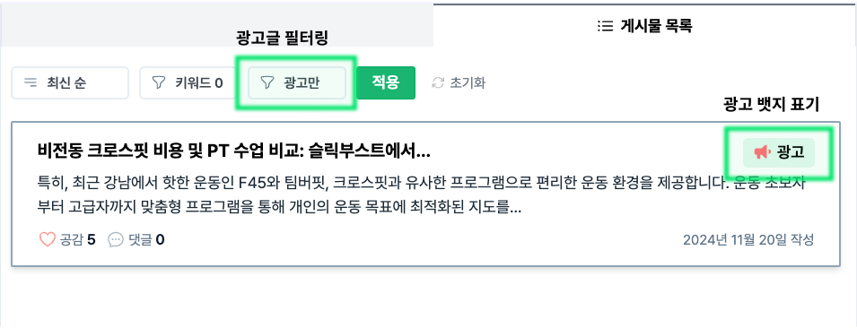

<br>

<details>
  <summary>
    광고 게시물을 분석 과정에서 미리 분류해두자
  </summary>
  <div markdown="1">

  <br>

- **`array` 타입으로 정의해둔 광고성 문구들 중 1개 이상의 text를 게시글 본문에서 포함한다면, 해당 글을 광고성 글로 분류하였습니다.**
- 프로젝트 초기 PoC 중 발견한 패턴은, 브랜드에 대한 블로그 게시물 중에는 광고성 글이 많다는 것이었습니다.
- 동시에, 이러한 글의 말미에는 광고 글이라는 사실을 게시물 독자들이 쉽게 인지할 수 있도록 하는 문구를 기재하고 있다는 것입니다.

  - 관련 규정을 확인해보니 [공정거래위원회 추천·보증 등에 관한 표시·광고 심사지침](https://www.ftc.go.kr/www/selectReportUserView.do?key=10&rpttype=1&report_data_no=10886)에 따라 최근 까지 엄격히 관리되고 있었습니다.
  - **이에 해당 문구들을 신뢰할만한 선별 기준이라 판단하고, 이를 광고성 글 분류 로직에 녹여보자는 아이디어를 구현하기로 결정했습니다.**

      <br>

      </div>
    </details>

<details>
  <summary>
    광고성 문구, 형식이 게시물 마다 다른 상황을 어떻게 해결할까?
  </summary>
  <div markdown="1">

  <br>

- `"이 글은 소정의 원고료를 받고 작성한 글입니다"`라는 일반적인 문구 외에도 글 마다 문구의 표현과 사용한 단어들이 달랐습니다.
- **광고성 문구를 `array` 타입으로 관리함으로써 문구가 다양하게 사용되는 상황에 대응하고, 추후 새롭게 발견되는 광고성 문구를 추가했습니다.**

  - 초기에는 `string` 타입으로 광고성 키워드를 정의하였으나, `array` 타입으로 변경하여 블로그 게시물 작성자들이 주로 사용하는 여러 문구들을 명시했습니다.
  - `string` 타입으로 특정 광고성 문구를 하나 만을 기준으로 검사하기에 블로그와 게시물 마다 상황이 다양했기 때문입니다.
  - (\*참고: 프로젝트를 목적을 학습에도 두고 있어, 광고성 글 분류 로직에 AI 모델을 활용하는 옵션은 고려하지 않았습니다.)

  <br>

- 추가로 까다로웠던 점은 텍스트로 표기하지 않고, 해당 문구를 포함한 이미지로 대체한 게시물의 케이스 입니다.
- **결론적으로, 사전 조사 과정에서 광고성 문구를 텍스트로 표기한 케이스가 약 70%로 확인하여 텍스트 검사 로직을 먼저 구현했습니다.**

  - 이미지 검사 로직 또한, 이미지를 텍스틀로 변환하는 과정이 추가될 뿐 결국 변환된 텍스트를 검사하는 로직을 활용하기 때문이기도 합니다.
  - OCR API를 활용하여 이미지로 포함한 글에 대해 대응 예정입니다. 먼저 아래 사항을 검토한 후 의사결정 했습니다.

    - API/라이브러리 검토 : Google Vision API, tesseract.js
    - 리서치 결과 tesseract.js가 한글을 제대로 변환하지 못하는 케이스가 발견되어 추후 Google Vision API를 활용하여 기능을 업데이트할 예정입니다.

        <br>

        </div>
      </details>

<br>

## 5-4. 기존 게시물 페이지네이션 구조에서 정렬, 필터링 기능을 어떻게 더할 수 있을까?

- 정렬/필터 기능을 추가하며, 매번 조건에 따라 DB에서 게시물을 선별한 후에 게시물 목록을 집계하도록 변경했습니다.
  - 이전에는, DB에 저장된 최근 게시물 순으로 게시물 목록을 응답으로 전달하는 것으로 충분했습니다.
- 페이지네이션 구조를 유지해 게시물 전체를 가져오지 않도록 하고, 게시물 목록이 증가하면서 원하는 게시물을 찾기 어려운 문제를 해결했습니다.

<br>

클라이언트 게시물 요청 (변경 전, 후)

```js
// as-is 조건 없이 최근 게시물순 요청
GET /posts/{keywordId}?limit=5&cursorId=""

// to-be 정렬/필터 조건에 따라 게시물 요청
GET /posts/{keywordId}?order=newest&includedKeyword=삼성점,강남점&excludedKeyword=왕십리점&isAd=false&limit=5&cursorId=""
```

서버 게시물 목록 연산 (변경 후)

```js
// to-be 정렬/필터 조건에 따라 응답으로 전달할 게시물 연산
const { _id: cursorObjectId } = await postModel.findById({ _id: cursorId }).exec();
const orderQuery = await getOrderQuery(order, cursorObjectId);

postListResult = await postModel.aggregate([
  {
    $match: {
      keywordId,
      content: contentFilter, // 포함, 제외 키워드 필터 적용
      ...getAdFilter(isAd), // 광고 포함 여부 필터 적용
    },
  },
  { $sort: getSortQuery(order) }, // 정렬 조건 적용
  {
    $match: order === "NEWEST" ? { _id: { $lt: cursorObjectId } } : orderQuery, // cursorId 적용
  },
  { $limit: limit },
]);
```

<br>

<details>
  <summary>
    정렬/필터 조건으로 정확한 게시물 목록을 전달하려면 클라이언트 ↔ 서버가 어떻게 통신해야 할까
  </summary>
  <div markdown="1">

  <br>

- 게시물 목록은 DB에 최근 게시물 순으로 저장된 순서가 아니라, 매번 정렬/필터 조건을 적용하여 게시물을 선별하고 클라이언트에 전달할 게시물 목록을 연산해야 합니다.
- 정렬 및 필터가 적용된 상태에서, 일종의 'cursor' 역할의 값을 정의해서 서버가 마지막 응답으로 반환한 row에 대한 값을 확인할 수 있도록 했습니다.
- 이를 통해 해당 요청에 대한 응답으로, 다음 전달해야할 row를 서버가 연산할 수 있게 합니다. 이전 응답으로 보낸 마지막 게시물의 `id`를 의미하는 `nextCursorId`를 cursor로 활용했습니다.
- 게시물 목록 첫 요청시 클라이언트가 받은 게시물이 없기 때문에 cursorId는 빈 문자열(`""`)로 보내고, 서버로부터 `nextCursorId`가 포함된 응답을 받은 후 부터는 해당 값을 cursor 파라미터로 요청을 보내게 됩니다.
- 그리고 서버는 더이상 응답으로 보낼 게시물이 없을 때 까지 이를 반복하게 되는데, `hasNext`를 함께 담아서 잔여 게시물이 더 없을 때 추가 요청하지 않도록 했습니다.

    <br>

    </div>
  </details>

<br>

<br>

# 6. 회고

<details>
  <summary>송규경</summary>
  <div markdown="1">

<br />

**1. [협업에 대한 이해]**

프로젝트를 진행하며 수많은 사안을 논의해 결정해야 했는데, 기능 우선순위부터 사소한 커밋 메시지 규칙까지 의견 조율이 필요했습니다. 팀 내 모두가 동등한 위치에서 합의점을 찾아야 했고, 이견이 좁혀지지 않을 경우 최후의 수단으로 다수결을 활용하기도 했습니다. 특정 기술적 논의에서는 각자의 기준과 이유로 사소한 의견 충돌이 있었고, 이를 해결하기 위해 저희는 회의 전 최소한의 근거를 준비하기로 결정했고 기술적 이해도를 맞추기 위해 노력했습니다. 코드 리뷰나 논의 과정에서 공식 문서, 블로그 글, 예시 코드 등 레퍼런스를 활용해 의견을 뒷받침하며, 이를 통해 우리 팀은 효율적인 의견 조율과 학습 효과를 동시에 얻을 수 있었습니다.

**2. [메타 인지]**

메타인지는 자신의 생각을 판단하는 능력으로, 내가 무엇을 알고 무엇을 모르는지를 이해하는 데 도움을 줍니다. 팀 프로젝트를 통해 저의 부족함과 강점을 인식하고, 안다고 생각한 개념을 설명하며 실제로 아는지 검증할 기회가 많았습니다. 설명하는 과정에서 이해 부족을 깨닫기도 하고, 이를 통해 개념을 다시 다질 수 있었습니다. 또한, 팀원들의 강점과 태도를 보며 배우고자 했고, 설득력 있는 주장 방식을 탐구하였습니다. 이러한 경험을 통해 세부 기능 기획 시 기술적 검증을 중시하거나, 중요하지 않은 논의에서는 비교적 유연한 태도를 보이는 제 자신의 성향도 발견하게 했습니다.

  </div>
</details>

<br>

<details>
  <summary>송진태</summary>
  <div markdown="1">
  <div>

  <br>

더 명확하게 소통하고 협업하기 위해, 실력을 키우고 싶다는 욕심이 더 생겼습니다. 내가 제안하는 아이디어를 쉽게 설명하거나, 구현방향에 대한 의견을 설득하는 것이 어려웠습니다. 결국 저의 말에 책임을 질 수 있는 역량을 높이자는 목표를 잡게 되었습니다.

팀원들과 서로 다른 관점을 좁혀나간 과정이 인상적이었습니다. 프로젝트 초반부, 서로 정의하는 핵심 기능이 달랐습니다. 블로그 게시물 차트가 누군가에겐 필수 기능이었고, 다른 이에겐 있으면 좋은 부가 기능이었습니다. 팀원들 모두 프로젝트의 진전이 중요했기 때문에, 함께 관점을 좁힐 방법을 적극적으로 고민할 수 있었습니다. “그림으로 소통하기”, “기능 구현 이전에 서로 스펙 공유 후 방향 좁히기” 등 저희 팀에 맞는 방법을 여러 시도했습니다. 때때로 멘토님께 함께 조언을 구하며 방향을 잡아가며 피드백을 수용하려는 태도도 도움이 되었습니다.

프로젝트의 과정, 결과 모두 제대로 하고자 하는 팀원들을 만나 감사했습니다. 팀 프로젝트에서의 구체적인 경험들로, 저 스스로 함께 협업하고 싶은 동료가 되기 위해 노력하고자 합니다.

  <br>

  </div>
  </div>
</details>

<br>

<details>
  <summary>장한솔</summary>
  <div markdown="1">
    <div>
    프로젝트를 진행하면서 소통의 중요성을 다시 한 번 깨닫게 되었습니다.
    <br>
    <br>
    초기 기획 단계에서 각자의 의견을 피력하고 다른 사람의 의견을 이해하고 수용하는 과정이 생각보다 오래 걸렸습니다. 그러나 다양한 의견들을 나누며 서로 이해하고 각자의 강점을 파악할 수 있었으며, 프로젝트를 진행하며 각자의 강점들을 적극 활용할 수 있었습니다.
    <br>
    <br>
    React-query, Express, MongoDB 등 새로운 기술을 배우고 적용하는 과정은 초반에 힘들었지만, 팀원들과 함께 각자 알게 된 내용을 정리한 문서를 공유하거나 서로 알려주는 시간을 가지며 효율적으로 진행할 수 있었습니다.  또한, 새로운 개념을 공부하면서 어떻게 설명해야 팀원들이 더 잘 이해할 수 있을까?에 대해 고민하고 다양한 방법을 시도해 보았고, 이를 통해 많이 성장할 수 있었던 프로젝트였습니다.
  </div>
  </div>
</details>
